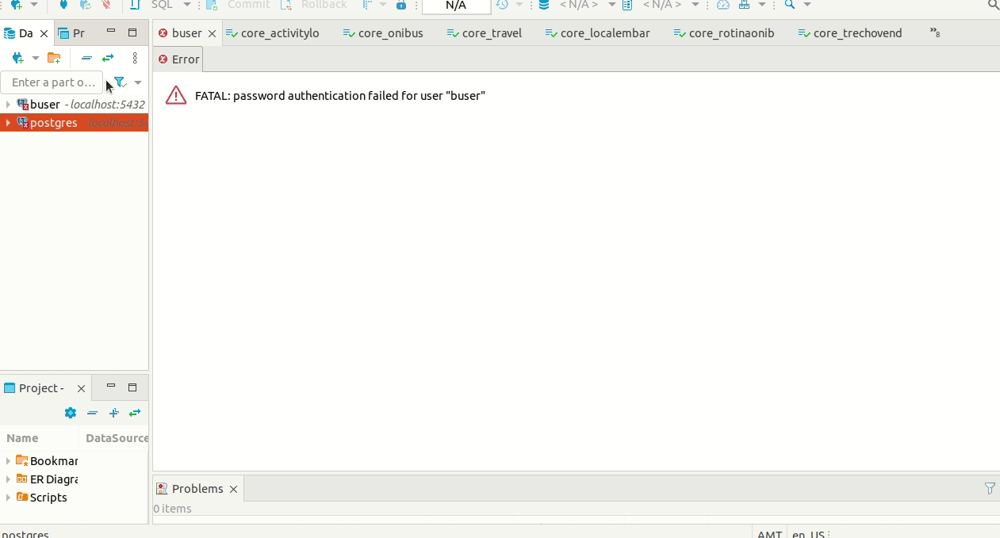
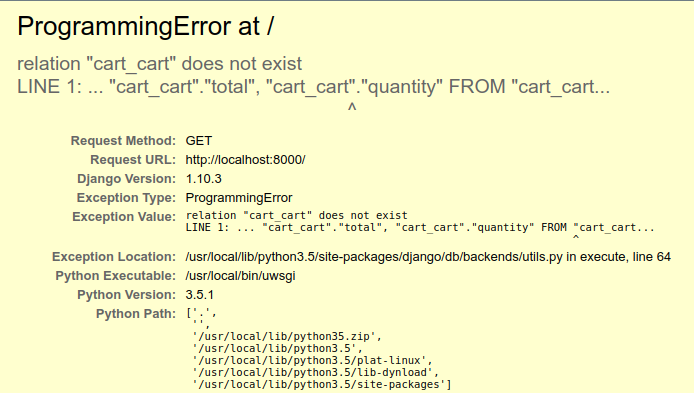

# Aulão do Tony sobre Docker
## Comece por aqui:
- Assista esses vídeos:   
[Docker em 20 minutos](https://www.youtube.com/watch?v=caGS9EztYlc)  
[NGINX - Pra que server isso?](https://www.youtube.com/watch?v=0jP84b2Zyzc)  

Tem mais material nas referências no final desse documento

## 1. Criar conta no [DockerHub](https://hub.docker.com/signup)

## 2. Instruções de instalação do docker:
https://github.com/huogerac/dev-tools/blob/master/ubuntu_20_04_focal/02_docker.sh  
Depois de instalado, confirmar se a instalação foi bem sucedida:
```sh
docker run hello-world
```
Se der pau com o acesso ao docker, uma solução rápida pode ser essa:  
```sh
sudo setfacl --modify user:<meu-username>:rw /var/run/docker.sock  
```
Com o Docker instalado e funcionando, vamos entender suas principais funções na prática.
## 3. Baixar uma nova imagem docker:
```sh
docker pull <nome-da-imagem>
```
Exemplo:
```sh
docker pull ubuntu
docker pull postgres
# baixar uma versão específica
doker pull postgres:10-alpine
```
No docker hub é possível encontrar uma infinidade de imagens. Sejam elas para Python, Node, Postgres...  
Só procurar lá e fazer um pull que é sucesso!
> Obs: O alpine é um unix muito leve onde são criadas algumas das imagens disponíveis.       

## 4. Rodando uma imagem Docker do ubuntu
Depois de baixar a imagem do ubuntu seguindo o comando anterior, execute-a com:
```sh
docker run -it ubuntu
```
Ao executar esse comando, será levantado o container com acesso ao bash, esse comando é o mesmo que executar:
```sh
docker run -it ubuntu bash
```
- `-it` conecta um pseudo-TTY na entrada padrão do container [Documentação](https://docs.docker.com/engine/reference/commandline/run/#examples).

## 5. Rodando uma imagem Postgres
Ao contrário de uma imagem Python, Ubuntu, Node, uma imagem de banco de dados precisa que especificamos como será feito o acesso de rede à essa imagem. Por isso, precisamos mapear as portas local:container.
```sh
docker run -e POSTGRES_USER=app -e POSTGRES_PASSWORD=app -p 5431:5432 postgres:10-alpine
```
- `-e`: export: exporta a variavel de ambiente  
- `-p`: port: mapeia as portas que serão utilizadas

No exemplo acima, levantamos um container, configuramos duas variáveis de ambiente, mapeamos a porta da nossa máquina (5431) com a porta padrão do postgres do container (5432) e informamos qual imagem utilizar.  
Feito isso, vamos acessar esse container através do dbeaver:  
Acessar dbeaver > nova conexão:  
username=app  
password=app  
porta=5431  
host=localhost  


>## Exercício 1:
No Dbeaver, crie uma nova tabela com qualquer quantidade de colunas, pode ser uma só inclusive.
Tenha certeza de salvá-la.
No terminal, mate o docker que está rodando o postgres. Se não souber identificá-lo, faça um
```sh
docker ps
docker kill id_do_container
```
Inicie novamente a imagem
```sh
docker run -e POSTGRES_USER=app -e POSTGRES_PASSWORD=app -p 5431:5432 postgres:10-alpine
```
Volte ao DBeaver e verifique a tabela criada anteriormente.  
__Conclusão do exercício:__  
O docker não mantém o estado das coisas. [Quero saber mais.](https://www.youtube.com/watch?v=Hbb5zP-2vTU&list=PLf-O3X2-mxDn1VpyU2q3fuI6YYeIWp5rR&index=4)

## 6. Persistindo os dados no meu container  
Para que a persistênciade de dados ocorra, precisamos mapear o volume do container à uma pasta local.  
Crie um pasta temporária dentro da pasta Documentos
```sh
mkdir $HOME/Documents/temp
```
Agora, vamos apontar essa pasta local ao volume do container `/var/lib/postgresql/data`.
```sh
docker run -e POSTGRES_USER=app -e POSTGRES_PASSWORD=app -p 5432:5432 -v $HOME/Documents/temp:/var/lib/postgresql/data postgres:10-alpine
```
Feito isso, execute os passos do exerício 1 novamente. Ao matar nossa instância e voltar ao DBeaver, a tabela agora estará lá.
Finalizamos a primeira parte de introdução. Agora vamos para a prática, utilizando um container com uma aplicação django.
Pra instigar o pensamento crítico:
Se uma máquina ECS é mais barata que um RDS, por que não configuramos nosso próprio container postgres em um ECS e economizamos dinheiro?
Resposta: Manter um servidor de dados é complicado, manter um servidor de dados em container mapeado à uma pasta local é mais complicado ainda. A segurança dos dados pode ser comprometida facilmente ao corromper algum arquivo na pasta mapeada, teríamos que ter mão de obra especializada para manter redundância e backup de tudo, além de outros problemas mais específicos de performance.  
Pra saber mais sobre armazenamento (isso vai fugir __muito__ do tema dessa aula)  
[RAID](https://www.techtarget.com/searchstorage/definition/RAID)  
[Dispositivos de Armazenamento](https://www.youtube.com/watch?v=c3hOS8BGbZo)  
[Entendendo Armazenamento](https://www.youtube.com/watch?v=lxjBgxmDZAI)  

---
# Exercício com o saleor
O objetivo desse exercício é levantarmos uma aplicação pré-configurada num container.
O Saleor é um ecommerce em Django com imagem disponível no Dockerhub. Nosso trabalho aqui será de baixar essa imagem e executá-la localmente. Vamos lá.
1. Vamos começar baixando a imagem:
```sh
docker pull saleordev/saleor
```
[link no dockerhub](https://hub.docker.com/r/saleordev/saleor)  
[github do projeto](https://github.com/saleor/saleor)  

1. Rodar a imagem e executar alguns comandos dentro dela.
```sh
docker run -it saleordev/saleor
# Olhar os arquivos do container
ls --color -lh
# parece que é uma aplicação Django, certo? Afinal, temos um requirements  
cat requirements.txt
# agora que olhamos nossas dependências
# vamos sair do nosso container
exit
```
Agora, vamos criar uma rede para que nosso container da aplicação possa se comunicar ao container do nosso banco de dados.
O comando abaixo vai criar uma rede chamada netsaleor. A vantagem de criar uma rede é que não precisamos mapear as portas, e expô-las.
```sh
docker network create netsaleor
```
Para listar as redes disponíveis
```sh
docker network list
```
Usando nossa nova rede junto com o postgres
```sh
docker run -e POSTGRES_USER=app -e POSTGRES_PASSWORD=app --net netsaleor -v $HOME/tmppostgres:/var/lib/postgresql/data postgres:10-alpine
# saia desse container com o comando existe
exit
# Agora liste os containers disponíveis
docker ps
# mate os containers que estiverem Rodando
docker kill id_container1 id_container2 ... id_containerN
```
Rodando de novo o comando para subir nosso container de banco de dados, agora com steroids:  
```sh
docker run --rm -d --name postgres -e POSTGRES_USER=app -e POSTGRES_PASSWORD=app --net netsaleor -v $HOME/tmppostgres:/var/lib/postgresql/data postgres:10-alpine
```
- `-d` (detach): faz um detach (não fica pendurado no terminal)  
- `--rm` (remove): se o docker morrer, remove esse cara e o lixo que ele criou  
- `--name`: Pra dar um nome pro nosso container.  
- `-e` (export): exporta a variável de ambiente  
 Importante: Precisamos _remover_ `--rm` depois dele morrer, caso contrario daria conflito de nome ao tentar levantar outro container com mesmo nome.  
Bora ver o que tá rolando por baixo dos panos desse container:
```sh
docker logs postgres
```
Viu, aqui já consegui chamar ele pelo nome que demos antes. Isso facilita a vida.
Agora que nosso banco de dados tá belezinha e rodando, vamos subir nosso container da aplicação e conectá-lo ao banco de dados
```sh
docker run -d --rm --name=saleor -p 8000:8000 --net netsaleor -e DATABASE_URL=postgres://app:app@db:5432/app -e SECRET_KEY=hjagdsjyatqt83652oiygjyrqi36 --link postgres:db saleordev/saleor
```
- `--net`: _netsaleor_ -> mesma rede que tá meu postgres
- `--link`: _db_container_name app_container_name_ -> mapeia os dois containers  
Pronto, agora que subimos nossa aplicação, conectada ao nosso banco de dados, vamos abrir nosso navegador no [localhost:8000](https://localhost:8000). Veja se a aplicação falhou com sucesso:  
  
Blz, agora que nossa aplicação falhou com sucesso, vamos corrigir.   
O que acontece aqui é que estamos conectando nossa aplicação django em um banco de dados novo, que não possui as tabelas e relações necessárias para a nossa aplicação funcionar corretamente. Vamos corrigir isso, fazendo as migrações no nosso banco.  
Lembre-se, estamos conectados ao nosso banco de dados que está dentro do container _postgres_, mas nossa aplicação está no container saleor. Então, vamos acessar nosso container da __aplicação__ e executar os comandos do django no terminal. Pra isso:
```sh
docker exec -it saleor bash
```
Opa, esse `docker exec` é novo pra gente. Pra resumir bem a conversa, o `docker run` levanta um container a partir de uma imagem enquanto o `docker exec` permite executar comandos dentro de um container que já está funcionando. Continuando...  
Dentro do container, vamos investigar o que tem lá:
```sh
ls --color -la
```
O esperado aqui é que aparece entre os arquivos, um arquivo `manage.py`. Agora que confirmamos que ele está aqui, vamos rodar as migrações.
```sh
./migrate.py migrate
```
Volte à página inicial, agora nossa aplicação deve estar rodando com sucesso.  
[localhost:8000](http://localhost:8000)  

Recapitulando:
- Aprendemos a levantar nosso container de aplicação (pré-configurado)  
- Levantamos um novo container de banco de dados, avançando nas configurações que havíamos visto na parte 1 dessa aula  
- Aprendemos como configurar uma rede e conectar dois containeres nessa mesma rede
- Avançamos nosso conhecimento sobre como executar comandos dentro de um container, fazendo inclusive as migrações de uma aplicação em um container, serem replicadas em outro container de banco de dados.

---
# Rodando nosso próprio projeto do zero
Agora que já sabemos rodar uma aplicação pré-configurada, vamos aprender a como configurar nossa própria aplicação para ser executada a partir de um Dockerfile.

### Verificando água e óleo do nosso carro:
Antes de sair dirigindo por aí, vamos primeiro confirmar se está tudo pronto.
1. Verifique se o projeto está rodando localmente  
`./manage.py runserver 8000`  
No navegador, acessar http://localhost:8000  
Ok, se a sua aplicação abriu, podemos continuar.
Agora, se você ainda não possui um projeto django configurado, pelo menos apresentando um Hello World e contendo um arquivo requirements.txt, agora é a hora de fazê-lo.
>_Disclaimer:_ Vou apresentar o Dockerfile com duas configurações, que servirão para referência futura. A primeira, e principal, consiste no uso do pip para gerenciamento de dependências. No segundo, utilizamos o Poetry.

Verificado o básicão, vamos começar a configuração pro Docker fazer a mágica no nosso projeto.
Na __raiz__ do projeto, criar um arquivo Dockerfile. Esse arquivo pode ser criado tanto clicando com Botão direito do mouse > criar arquivo ou no terminal:
```sh
touch Dockerfile
```
É assim mesmo, D maiúsculo e sem extensão.  
O Dockerfile é uma receita para criação de uma nova imagem. Com a receita pronta, nós podemos criar (buildar) uma nova imagem.
> Aproveitando a analogia com comida, o Docker constrói a imagem em camadas. Cada alteração numa camada, só afeta essa camada e as camadas acima dela. Pensando numa lasanha, depois que você constrói a primeira camada da lasanha ela não será afetada ao montar a segunda, terceira ou quarta camadas. Agora, se você estiver com a sua lasanha pronta e resolver mudar o recheio da primeira camada, você vai precisar desmontar e montar todas as camadas acima pra poder remontar a primeira, sacou? Agora vamos falar de Docker novamente.  

Vamos começar nossa receita da lasanha aos poucos. Pra começar, vamos montar uma imagem Python.
```sh
FROM python:3.8.10-slim
```
No terminal, dentro da pasta onde está meu Dockerfile:
```sh
docker build -t nome_que_eu_quiser .
```
CUIDADO: Esse `.` (ponto) no final é importante, ele tá passando o _Path_ de onde buscar o Dockerfile.  
Se sua configuração funcionou, você vai receber uma saída **parecida** com essa aqui:
```sh
Sending build context to Docker daemon  47.89MB
Step 1/1 : FROM python:3.10.4-slim
3.10.4-slim: Pulling from library/python
42c077c10790: Pull complete
f63e77b7563a: Pull complete
0c31162eec9d: Pull complete
7cfd3784111c: Pull complete
791791ccdd73: Pull complete
Digest: sha256:557745c5e06c874ba811efe2e002aff21b6cc405b828952fcfa16dea52d56dbb
Status: Downloaded newer image for python:3.10.4-slim
 ---> 56cb06bdaede
Successfully built 56cb06bdaede
Successfully tagged curso_tony:latest
```
Certo, montamos a primeira camada da lasanha. Enquanto não alterarmos nada aqui, o Docker usará o cache para buildar novas versões. Isso vai nos poupar processamento, tempo e $.  
Agora, vamos acrescentar mais uma camada. Nessa camada, vamos passar pro docker qual será nossa pasta de trabalho onde vamos copiar nossos arquivos e instalar nossas dependências. Adote uma das configurações abaixo:

### Dockerfile pra quem gosta de Pip
```sh
FROM python:3.8.10-slim
WORKDIR /app
COPY requirements.txt ./
RUN pip install -r requirements.txt
COPY . /app
```
### Dockerfile pra quem gosta de Poetry
```sh
FROM python:3.8.10-slim
WORKDIR /app
RUN pip install poetry
COPY pyproject.toml poetry.lock ./
RUN poetry config virtualenvs.create false \
  && poetry install --no-interaction --no-ansi
COPY . /app
```
> Aqui tem uma manha importante. Alí no primeiro `COPY` nós só copiamos o arquivo `requirements.txt` da nossa pasta atual. Depois de instalar nossas dependências, nós copiamos os demais arquivos. De forma análoga com o Dockerfile para o Poetry e isso tem um bom motivo.  
Fazendo dessa forma, nós podemos alterar qualquer arquivo da nossa aplicação, exceto o requirements.txt, sem que o docker reinstale as dependências, que é uma etapa demorada. Caso tivéssemos copiados todos os arquivos uma única vez, a cada edição de qualquer um deles, o docker executaria novamente o `pip install`, mesmo que o requirements.txt não tivesse sido editado. Lembre-se, o requirements aqui está numa camada mais baixa da nossa lasanha enquanto nossos arquivos estão numa camada mais acima.

Depois de atualizar o Dockerfile, precisamos atualizar o build da nossa imagem. No terminal, rode novamente o comando:
```sh
docker build -t nome_que_eu_quiser .
```
Dessa vez, perceba no log abaixo que o Docker não baixou novamente a imagem Python, já que continua a mesma versão.
```sh
Sending build context to Docker daemon  47.89MB
Step 1/5 : FROM python:3.8.10-slim
 ---> 56cb06bdaede
Step 2/5 : WORKDIR /app
 ---> Running in d5962ca06c2d
Removing intermediate container d5962ca06c2d
 ---> 557df345ef49
Step 3/5 : COPY requirements.txt ./
 ---> 05ab2043d48c
Step 4/5 : RUN pip install -r requirements.txt
 ---> Running in 7573b845b2b0
Collecting django==4.0.5
  Downloading Django-4.0.5-py3-none-any.whl (8.0 MB)
     ━━━━━━━━━━━━━━━━━━━━━━━━━━━━━━━━━━━━━━━━ 8.0/8.0 MB 9.6 MB/s eta 0:00:00
Collecting sqlparse>=0.2.2
  Downloading sqlparse-0.4.2-py3-none-any.whl (42 kB)
     ━━━━━━━━━━━━━━━━━━━━━━━━━━━━━━━━━━━━━━━━ 42.3/42.3 KB 3.6 MB/s eta 0:00:00
```
Agora, só pra reforçar. Vamos alterar a versão do python no nosso Dockerfile e atualizar nossa imagem pra ver o que acontece.
Altere apenas a primeira linha do seu Dockerfile para o seguinte:  
```sh
FROM python:3.10.4-slim
```
Execute o build novamente:
```sh
docker build -t nome_que_eu_quiser .
```
Agora veja no log que ele fez o pull da nova imagem e reconstruiu as etapas (Steps) da sua imagem:
```sh
Sending build context to Docker daemon  47.89MB
Step 1/5 : FROM python:3.10.4-slim
3.10.4-slim: Pulling from library/python
b4d181a07f80: Pull complete
de8ecf497b75: Pull complete
...
Step 5/5 : COPY . /app
 ---> eb235c8c6aca
Successfully built eb235c8c6aca
```
Agora, pra ver ele utilizando o cache, execute o build novamente. A saída será similar a essa:
```sh
Step 1/5 : FROM python:3.10.4-slim
 ---> 56cb06bdaede
Step 2/5 : WORKDIR /app
 ---> Using cache
 ---> 557df345ef49
Step 3/5 : COPY requirements.txt ./
 ---> Using cache
 ---> 05ab2043d48c
Step 4/5 : RUN pip install -r requirements.txt
 ---> Using cache
 ---> 1e4c803cf647
Step 5/5 : COPY . /app
 ---> Using cache
 ---> 116415c65872
Successfully built 116415c65872
Successfully tagged curso_tony:latest
```
Se for atento aos logs, você verá que ele mostra quando utilizou o cache, veja por exemplo a nossa etapa 5 quando rodamos novamente o docker build:
```sh
Step 5/5 : COPY . /app
 ---> Using cache # aqui ele deixa explícito que não precisamos rebuildar
 ---> 116415c65872
```
Pronto! Já temos um Dockerfile funcional para rodar nossa aplicação. Vamos testá-lo?  

#TODO
- Terminar a Documentação desses passos:  
1. Executar nosso container localmente, passando runserver como parâmetro.
2. Subir nosso container para o DockerHub
3. Incluir o runserver no Dockerfile
4. Recompilar
5. Atualizar imagem no Dockerhub
- Documentar parte da aula sobre AWS

## Outro exemplo de Dockerfile, instalando outros pacotes linux.
```sh
FROM python:3.10
WORKDIR /app
RUN apt-get update && \
    apt-get install --no-install-recommends -y \
    wait-for-it \
    curl \
    gcc libmemcached-dev zlib1g-dev && \
    pip install uwsgi uwsgitop \
    pip install poetry
COPY pyproject.toml poetry.lock ./
RUN poetry config virtualenvs.create false \
  && poetry install --no-interaction --no-ansi
COPY . /app
```

---
# Configurando nosso servidor na nuvem

Aqui só tem rascunho, desconsiderar por enquanto essa zona

- ping nome_repo.busercamp.com.br
- ssh ubuntu@<<nome_repo>.busercamp.com.br>  
Facilitando nossa vida, [criando um arquivo SSHConf:](https://linuxize.com/post/using-the-ssh-config-file/)    
Exemplo de um arquivo:
```
Host aula_tony
  HostName username.busercamp.com.br
  User ubuntu
  IdentityFile ~/.ssh/rsa
```
Feito isso, fica assim para acessar a máquina remota:
```sh
ssh aula_tony
```
Além de não precisarmos decorar nada, nem depender do autocomplete toda vez, ainda temos as configurações salvas no arquivo, caso precisemos replicar no futuro.
- docker pull my_image_name
- docker run -d -p <porta_acordada_com_os_demais>:8000 --name <seu_nome> <image>

```sh
docker run -it -p 8000:8000 curso_tony ./manage.py runserver 0.0.0.0:8000
```

server {
    listen       80;
    server_name  django_clarita.busercamp.com.br;
    location / {
        proxy_pass http://localhost:8001/;
	include proxy_params;
    }
}

(isso vai no /etc/nginx/sites-enabled/clara.conf)
sudo service nginx reload
recarrega a configurcao do nginx
docker run -d -p 8001:8000 --name clara clarasantosmf/django_clarita

CMD ./manage.py runserver 0.0.0.0:8000
pushando minha imagem
docker tag django_prata:latest ovictorprata/django_prata  
docker login  
docker push wfoschiera/private:tagname  


# Outras referências
[Evolutio - Deploy Profissa](https://evolutio.io/curso/deploy_profissa)  
[LinuxTips - Descomplicando o Docker](https://www.youtube.com/playlist?list=PLf-O3X2-mxDn1VpyU2q3fuI6YYeIWp5rR)

# Bizus
`ls --color -lh` -> Listar arquivos destacando por cor  
`docker run` -> levanta container  
`docker exec` -> rodar um novo processo num container que já tá rodando  
`ps -ef` -> dentro da execução do container, pra ver o que tá rodando.  
`env` -> lista as variáveis de ambiente  

### To perdidão no Dockerfile
Posso criar um Dockerfile executando comandos do terminal para eu analisar os logs. No exemplo abaixo conseguimos visualizar o caminho da pasta raiz do container, listamos os arquivos. Depois, com o comando WORKDIR criamos uma pasta /app e acessamos ela. Depois, listamos de há arquivos e imprimimos o caminho completo dessa pasta.
```
FROM python:3.10.4-slim
RUN realpath .
RUN ls --color -la
WORKDIR /app
RUN ls --color -la
RUN realpath .
```

### Documentação do Docker
Example: run htop inside a container
Dockerfile
```sh
FROM alpine:latest
RUN apk add --update htop && rm -rf /var/cache/apk/*
CMD ["htop"]
```
```sh
docker build -t myhtop .
```
```sh
docker run -it --rm --pid=host myhtop
```
